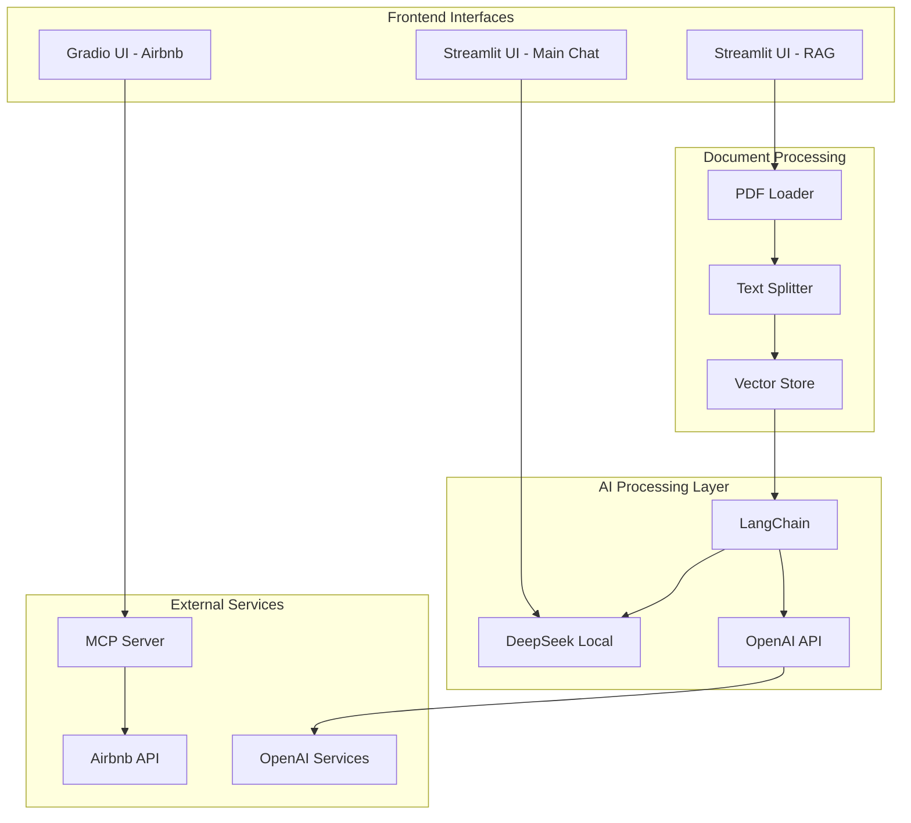
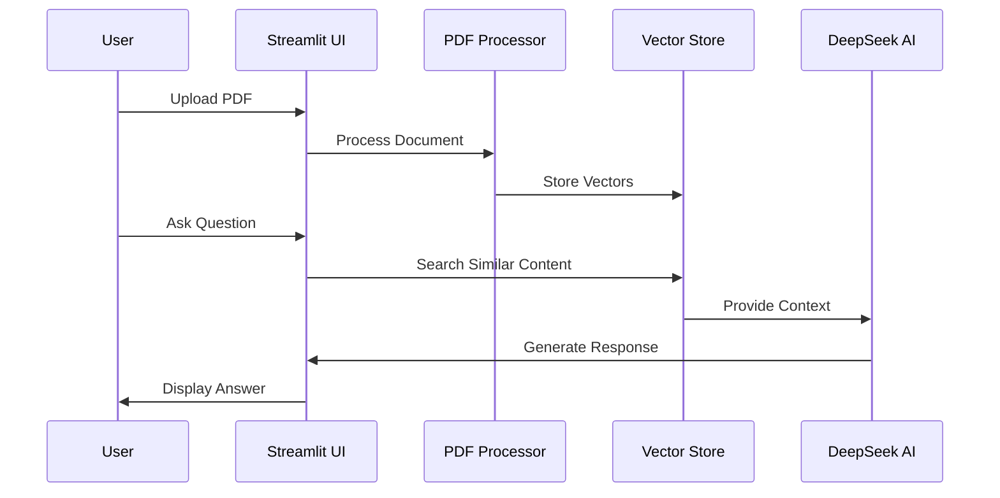

# 🤖 GenAI Explorer


## Table of Contents
- [Overview](#overview)
- [System Architecture](#system-architecture)
- [Features](#features)
- [Components](#components)
- [Installation](#installation)
- [Usage](#usage)
- [Configuration](#configuration)
- [Security](#security)

## Overview
A comprehensive GenAI toolkit featuring local DeepSeek model implementation, document processing (RAG), and integration with various services including Airbnb booking and OpenAI API.

## System Architecture

### Complete System Flow


### RAG Implementation Flow


## Features
- 🤖 Local DeepSeek model integration (1.5b and 3b variants)
- 📚 RAG implementation with PDF processing
- 🏠 Airbnb booking assistant with MCP server
- 🔄 OpenAI API integration
- 💅 Custom-styled UI interfaces
- 📊 Vector store for document retrieval

## Components

### 1. Main Chat Application (`app.py`)
```python
# Key configurations
llm_engine = ChatOllama(
    model=selected_model,
    base_url="http://localhost:11434",
    temperature=0.3
)
```

### 2. RAG Implementation (`rag_deep.py`)
```python
# Core components
EMBEDDING_MODEL = OllamaEmbeddings(model="deepseek-r1:1.5b")
DOCUMENT_VECTOR_DB = InMemoryVectorStore(EMBEDDING_MODEL)
LANGUAGE_MODEL = OllamaLLM(model="deepseek-r1:1.5b")
```

### 3. Airbnb Search (`airbnb_search.py`)
```python
agent = Agent(
    instructions="""You help book apartments on Airbnb.""",
    llm="gpt-4o-mini",
    tools=MCP("npx -y @openbnb/mcp-server-airbnb")
)
```

## Installation

```bash
# Clone repository
git clone <repository-url>

# Install dependencies
pip install -r requirements.txt

# Required packages
streamlit
langchain_core
langchain_community
langchain_ollama
pdfplumber
praisonaiagents 
mcp
openai
gradio
requests
```

## Usage

1. **Start Main Chat Interface**
```bash
streamlit run app.py
```

2. **Launch Document Assistant**
```bash
streamlit run rag_deep.py
```

3. **Start Airbnb Search**
```bash
python airbnb_search.py
```

## Configuration

### DeepSeek Model Settings
```python
# Available models
models = ["deepseek-r1:1.5b", "deepseek-r1:3b"]

# RAG Configuration
CHUNK_SIZE = 1000
CHUNK_OVERLAP = 200
```

## Security
- 🔒 Secure API key management
- 🏢 Local model execution
- 🔐 No data persistence
- 📄 Safe document handling

---
📝 **Note:** Ensure all API keys and configurations are properly set before running the applications.

This README now includes:
- Detailed system architecture diagrams
- Component interaction flows
- Code snippets from actual implementation
- Clear installation and usage instructions
- Security considerations

